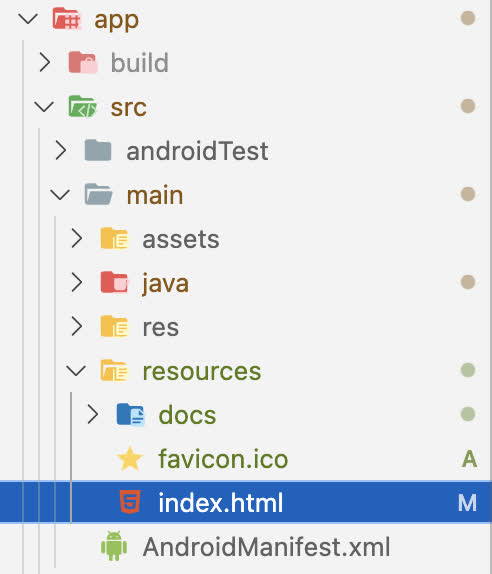
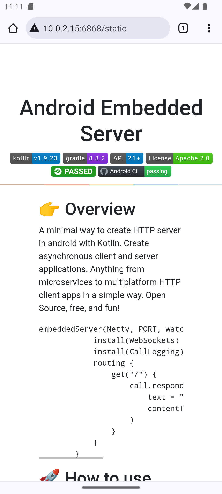
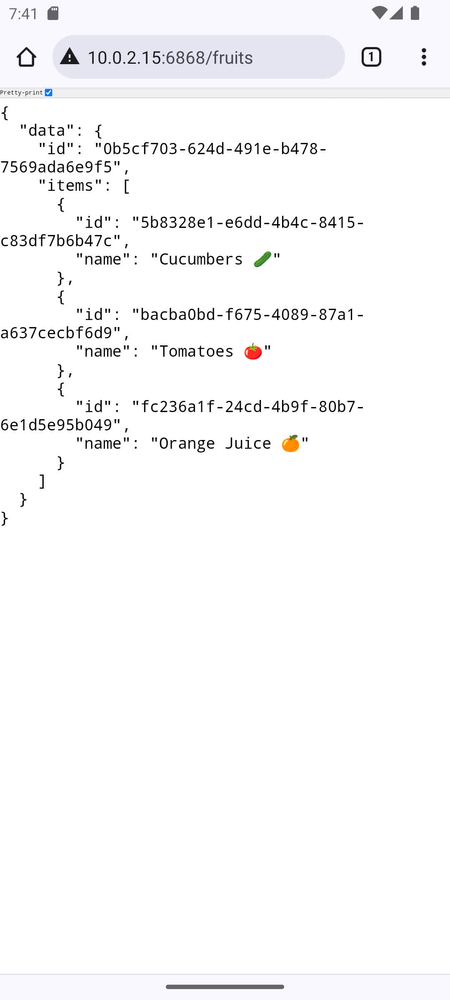
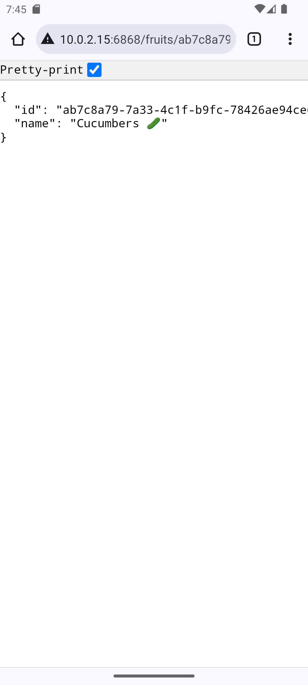
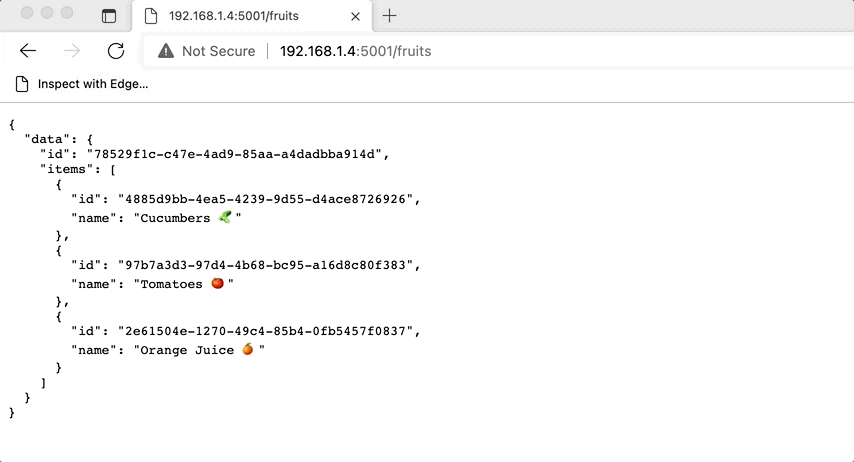

<h1 align="center"> Android Embedded Server </h1>

<div align="center">
    
    
    
    
    
    <a href="https://github.com/nphau/android.embeddedserver/actions/workflows/app-build.yml"></a>
</div>


## 👉 Overview

A Remote Data Transfer Application for use with DJI Drones, forked from the [Android Embedded Server](https://github.com/nphausg/android.embeddedserver) Project.

## 🍲 Static resource

Config | Demo |
--- | --- |
 |  |

```kotlin
    staticResources("/static", ""){
        default("index.html")
    }
```

## 🍲 Screenshots

<h4 align="center">

Fruits | Detail |
--- | --- |
 |  |

Device | Connect |
--- | --- |
 |  |

## README will be updated as the Project progresses...